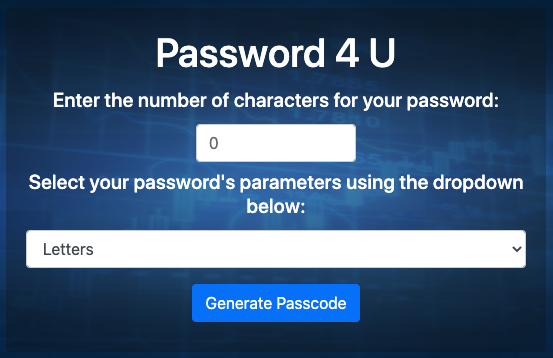

# Password 4 U

### Created on 6/2/2020 (updated 9/14/2020)

### By longhike

## Description:

This is a password generator that will generate a random string between 8 and 128 characters, given a set of entered parameters. 

## Set-up & Installation requirements:

Node.js 

run `node server.js` or `npm start` in your terminal, and open your browser to the indicated localhost port.

## Known Bugs:

No known bugs.

## Support & Contact details:

e-mail long.hike.dev@gmail.com

## Technologies Used

HTML

CSS

Boostrap

Javascript

Node.js

Express.js

## Contribution Guidlines 
​
Direct link to site:
http://password4u-env.eba-ybnfmahx.us-east-2.elasticbeanstalk.com/
​
### License
​
Copyright(c) 2020 By longhike
​
This software is licensed under MIT license.
